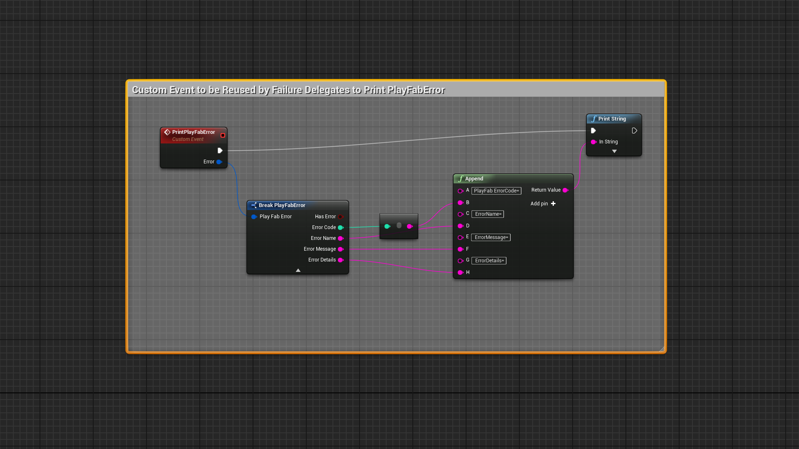
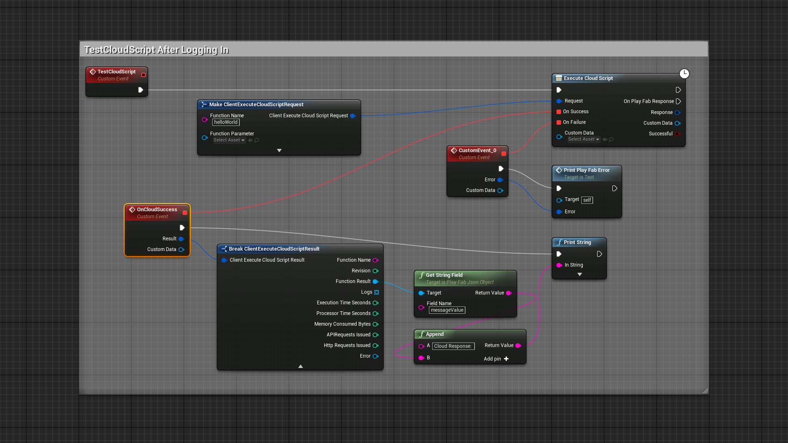
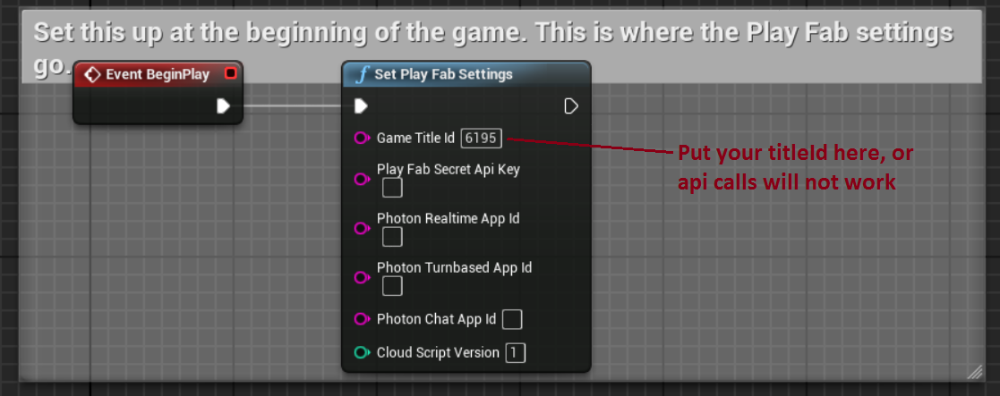
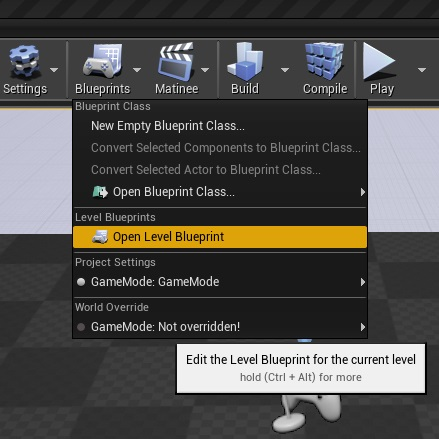

# Unreal 4 Blueprint SDK-Collection for PlayFab README


## 1. Overview:

Unreal 4.14 - 4.17 Blueprint SDKs for PlayFab

Our example project requires setting a #define if you're using an older version.  See the Setup section below.

The Unreal Blueprint SDK-Collection includes three separate Unreal plugins.  You should only install 1 of these plugins in any Unreal project.

* Unreal Client SDK for distribution to End-Users
* Unreal Server SDK for secure machines running sensitive logic
* Unreal Combo SDK for demoing, testing, and special-case circumstances - Typical users will not use this for production code


## 2. Prerequisites:

* Users should be very familiar with the topics covered in our [getting started guide](https://api.playfab.com/docs/general-getting-started).

To connect to the PlayFab service, your machine must be running TLS v1.2 or better.
* For Windows, this means Windows 7 and above
* [Official Microsoft Documentation](https://msdn.microsoft.com/en-us/library/windows/desktop/aa380516%28v=vs.85%29.aspx)
* [Support for SSL/TLS protocols on Windows](http://blogs.msdn.com/b/kaushal/archive/2011/10/02/support-for-ssl-tls-protocols-on-windows.aspx)


## 3. Setup:

For building the game client, distributed to the End-User, you must only use the PlayFabClientSDK.

A game server is not required for all games, however many online games require online server architecture.  PlayFab also does not require you to use the same SDK for client and server.  If your game-server is a separate stand-alone console application, it is possible to use the [C++ WindowsSDK](https://github.com/PlayFab/WindowsSDK).  If your game-server requires an Unreal environment, you can also use the PlayFabServerSDK provided with in the Unreal SDK-Collection.

To implement both client and server in Unreal, you must create two separate projects, and install each plugin separately.


## 4. Installation:

The following instructions apply to each of the three SDKs provided in the Unreal SDK-Collection.

Assumptions

* Windows operating system
* [Microsoft Visual Studio](https://www.visualstudio.com/en-us/products/visual-studio-community-vs.aspx) already installed
* [Unreal Engine](https://www.unrealengine.com/dashboard) already installed

A new project can be built directly from the example project included with each SDK:

* Extract the Unreal SDK package to {PlayFabUnrealSdk}
* Navigate to {PlayFabUnrealSdk}/PlayFabClientSDK/ExampleProject
* Right click on ExampleProject.uproject, and "Generate Visual Studio project files" - This process may take several minutes
* Once finished, open {PlayFabUnrealSdk}/PlayFabClientSDK/ExampleProject/ExampleProject.sln in Visual Studio
* In Visual Studio, "Rebuild Solution" - This process may take several minutes
* You should now be able to create blueprints that utilize PlayFab API calls

Existing Projects:
* Extract the Unreal SDK package to {PlayFabUnrealSdk}
* Navigate to {PlayFabUnrealSdk}/PlayFabClientSDK\PluginFiles
* Copy the PlayFab folder into the "Plugins" directory in your existing Unreal project (If the "Plugins" folder does not exist, create it)
* Right click on ExampleProject.uproject, and "Generate Visual Studio project files" - This process may take several minutes
* Once finished, open your *.sln project file with Visual Studio
* In Visual Studio, "Rebuild Solution" - This process may take several minutes
* You should now be able to create blueprints that utilize PlayFab API calls

### Using the Example Project with older versions

UE 4.16 introduced a few syntax changes that are not reverse compatible. As such, we've had to add a #define swtich that will let you run on older versions, but it requires a manual step, because UE doesn't set up #define symbols in their C# build code.

Search the *.target.cs and *.build.cs files for: PF_UNREAL_OLD_4_14_TO_4_15, and enable this define if you're using an older version.
After the next release, you should be able to [click here](https://github.com/PlayFab/UnrealBlueprintSDK/search?utf8=%E2%9C%93&q=) to see the #defines

### Developer Console

The `Developer Console` allows execution of custom commands which can be used to invoke a `CustomEvent` in the `Level Blueprint`.


#### UE4 Editor

In the editor the developer console can be opened by pressing the tilda (~) key.


#### Android

`Verify Peer` may need to be disabled to allow `HTTPS` traffic to communicate with the server on Android.

```
Edit->Project Settings->Engine->Network->Libcurl->Verify Peer (Set to OFF)
```


Make sure that the console is enabled in project settings to use the developer console on Android.

```
Edit->Project Settings->Input->Mobile->Show Console on Four Finger Tap->True
```

Four finger tap will open the console on an `Android` tablet. The console command can be entered and then tap `Ok` to execute.

The `ADB` logcat will display the console logs which show any `PrintString` blueprints that were used.

```
adb logcat
```


### Blueprint Custom Events

Follow the `Blueprint Tutorial` below to populate the `Game Title Id` before invoking the following `Blueprint Custom Events`.  Also note that these examples use the Client-api, which does not work in the server.  For the server Example project, just remove the custom events with errors before you run the program (several examples work in all plugins, but client-login and client-cloudscript do not)

#### Custom Event PrintPlayFabError

`PlayFab Client API` methods have a failure delegate that has a `PlayFabError` parameter. A custom event that prints `PlayFabError` objects can be reused by the failure delegates. This setup uses a `PrintPlayFabError` custom event with a `PlayFabError` parameter. The `PlayFabError` is broken out into components that can be appended to a string and printed. The `PrintPlayFabError` custom event can be connected directly to a failure delegate or called from another custom event.




#### TestLogin

`TestLogin` is a custom event that will register and/or login a user given a unique customId

The `OnSuccess` delegate will be executed upon success.


The custom event can be invoked in the console with the following line.

```
ce TestLogin arbitraryCustomId
```

On Android, the custom event can be invoked in the console and the command can be entered over `ADB` with the following line (after activating the console window with 4-finger tap).

```
adb shell input text "ce%sTestLogin%sarbitraryCustomId"
```

The output log should print output similar to the following for a success event.

```
Cmd: ce TestLogin arbitraryCustomId
LogPlayFab: Request: {
    "TitleId": "YOUR_GAME_TITLE_ID",
    "CustomId": "arbitraryCustomId"
}
LogPlayFab: Response : {
    "code": 200,
    "status": "OK",
    "data":
    {
        "SessionTicket": "LONG_SESSION_TICKET",
        "PlayFabId": "EDC7CAE0DCB6FA8F",
        "NewlyCreated": false,
        "SettingsForUser":
        {
            "NeedsAttribution": false
        },
        "LastLoginTime": "2016-01-29T02:18:16.692Z"
    }
}
LogBlueprintUserMessages: [Test_C_1] Login Success:
SessionTicket=LONG_SESSION_TICKET PlayFabId=EDC7CAE0DCB6FA8F
```

The `OnFailure` delegate will be executed if a `PlayFabError` occurs.


#### TestCloudScript

`TestCloudScript` is a custom event that will execute cloud script given no parameters.  Without changes, it is preset to call a pre-existing "helloWorld" function.

The `OnSuccess` delegate will be executed upon success.



The custom event can be invoked in the console with the following line.

```
ce TestCloudScript
```

On Android, the custom event can be invoked in the console and the command can be entered over `ADB` with the following line.

```
adb shell input text "ce%sTestCloudScript"
```

The output log should print output similar to the following for a success event.

```
Cmd: ce TestCloudScript
LogPlayFab: Request: {
    "FunctionName": "helloWorld",
    ...
}
LogPlayFab: Response : {
    "code": 200,
    "status": "OK",
    "data": {
        "FunctionName": "helloWorld",
        "Revision": 1,
        "FunctionResult": {
            "messageValue": "Hello 1337D00D!"
        },
        "Logs": [
            {
                "Level": "Info",
                "Message": "Hello 1337D00D!"
            }
        ],
        "ExecutionTimeSeconds": 0.00063979999999999994,
        "MemoryConsumedBytes": 16208,
        "APIRequestsIssued": 0,
        "HttpRequestsIssued": 0
    }
}
LogJson:Warning: Field Results is of the wrong type.
LogJson:Error: Json Value of type 'Null' used as a 'Object'.
LogBlueprintUserMessages: [Test_C_1] TestCloudScript Success: "Hello World"
```

The `OnFailure` delegate will be executed if a `PlayFabError` occurs. A failure might occur if `TestCloudScript` was invoked before the user was authenticated resulting in `Missing or invalid X-Authentication HTTP header`.


## 5. Blueprint Tutorial:

The plugin is fairly simple to use. The main things you need to learn are; how to use the provided JSON objects, how to wire up the nodes, and realize that it is extremely simple!

Below are the steps to add an API call node, and manipulate the response JSON object. We will make a simple login with email function that will print out the response JSON object to the screen.

* PlayFab Title setup:
 * You must have a PlayFab account, and you must have created a Title on our website: (https://developer.playfab.com/en-us/studios)
 * Open the Unreal editor by double clicking on the project file.
 * Got to the top bar and select "Blueprints" then "Open Level Blueprint" from the drop down menu.
 * You must tell UnrealSDK about your PlayFab Title
  * In the Level Blueprint, there is a call to SetPlayFabSettings.  Fill in any relevant information including:
  * The TitleId field is mandatory for all api-calls
  * The DevSecretKey is required for all server/admin/matchmaker calls - For security reasons you must never expose this value to players, and neither input nor publish this value into a client build
  * 
* Unreal Setup
 * 
 * The example project will have some pre-made blueprints that you may use as a template
 * Log in a player
  * This example will use [LoginWithCustomID](https://api.playfab.com/Documentation/Client/method/LoginWithCustomID)
  * Setup the login command:
   * Right click on an empty spot and add an "Add Custom Event Node".
   * Name it "TestLogin"
   * Now add a string variables named: "customId"
   * Right click again and search for the "Login With Custom ID" node located in "Play Fab/Client/Authentication".
    * You can also type "login" in the search field to find it quicker.
   * Wire up the event inputs to the LoginWithCustomID inputs
   * The response on any api call is a custom container that can be broken into more useful types
   * Drag off from the response node and search for "Break" - In this case "Break ClientLogin Result"
   * Now wire any useful parameters to appropriate destinations - In this case print PlayFabId, and SessionTicket
   * 
* Now run the project and in the play in editor window hit the tilde ~ key twice. This will bring up the console manager, and make it mostly fullscreen
* You should execute this every time you start a client: *ce TestLogin arbitraryCustomId*
* Once you hit enter you should get the response printed out on the screen.


## 6. testTitleData.json file required for "StartTest" custom event

This sdk includes an optional custom event, and testing node that is used by PlayFab to verify sdk features are fully functional.

Please read about the testTitleData.json format, and purpose here:
* https://github.com/PlayFab/SDKGenerator/blob/master/JenkinsConsoleUtility/testTitleData.md
The file location is read from the hard-coded loction of: TEST_TITLE_DATA_LOC in PfTestActor.h, you can redirect this to an input that matches your file location

## 7. Troubleshooting:

If you experience this error:
Plugin 'PlayFab' failed to load because module 'PlayFab' could not be found.  Please ensure the plugin is properly installed, otherwise consider disabling the plugin for this project.

Your Unreal project is not set up to be a C++ project.  Here is a tutorial that will help fix this problem.
http://idkudk.blogspot.com/2015/02/how-to-get-plugins-to-package-correctly.html

If you are building for iOS, there is a temporary issue where the "BSD UMETA(DisplayName = "BSD")," line in PlayFabEnums.h throws an error.  This issue will be resolved soon.  Delete that line if you are building to Apple devices.

General troubleshooting:

For a complete list of available APIs, check out the [online documentation](http://api.playfab.com/Documentation/).

#### Contact Us
We love to hear from our developer community!
Do you have ideas on how we can make our products and services better?

Our Developer Success Team can assist with answering any questions as well as process any feedback you have about PlayFab services.

[Forums, Support and Knowledge Base](https://community.playfab.com/index.html)


## 8. Acknowledgements

The initial draft of PlayFab UnrealBlueprintSDK and the Blueprint Tutorial in this document were built by [Joshua Lyons](https://github.com/JLyons1985), and submitted to PlayFab October, 2015


## 9. Copyright and Licensing Information:

  Apache License --
  Version 2.0, January 2004
  http://www.apache.org/licenses/

  Full details available within the LICENSE file.

